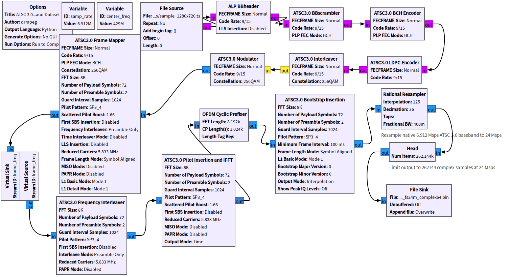
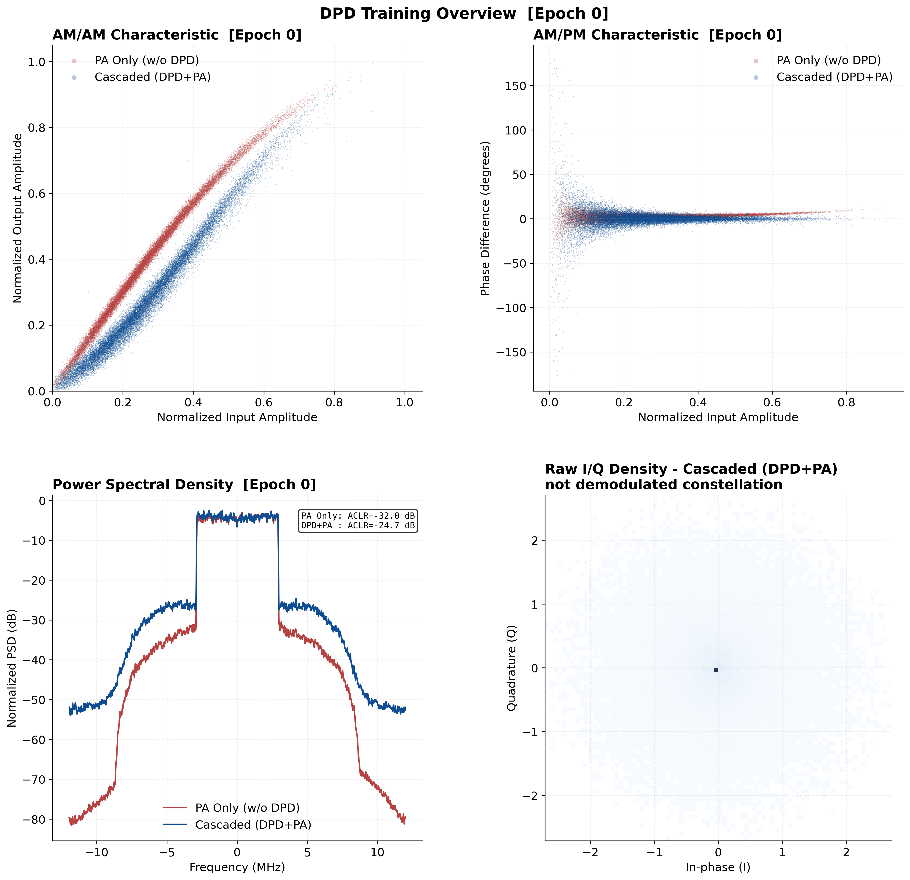
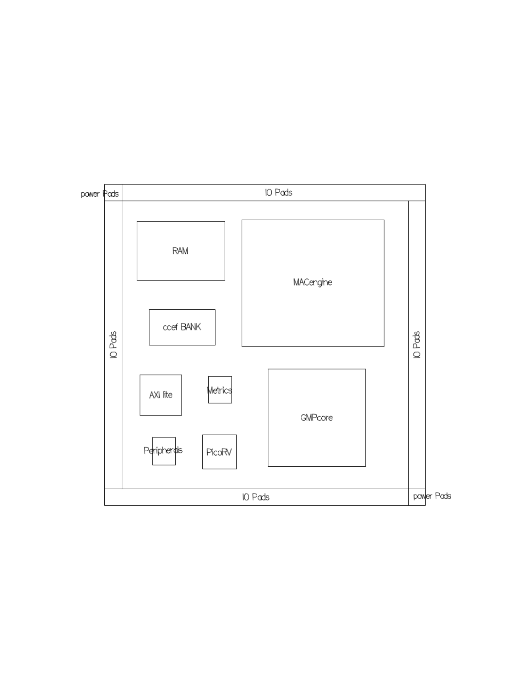
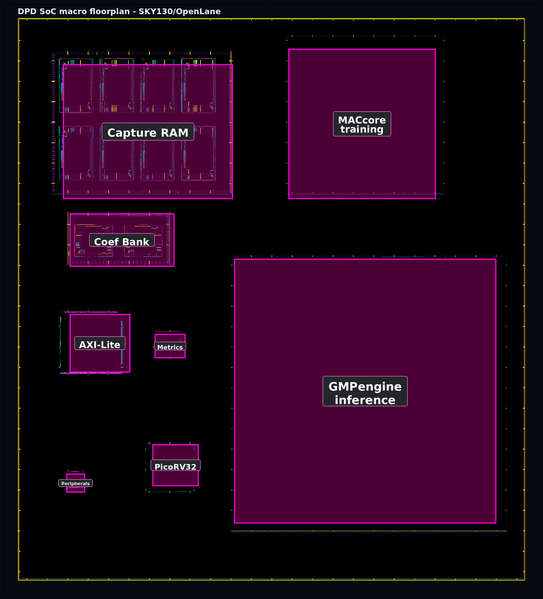

# VLSI Implementation of DPD for Next-Generation Digital TV Transmitters

Este repositório reúne o desenvolvimento de um sistema de pre-distorção digital
(Digital Predistortion, DPD) para transmissores de televisão digital de próxima
geração. O trabalho parte da geração de sinais OFDM em banda-base, passa pela
modelagem e treinamento do DPD, avança para a implementação em HDL e termina em
uma avaliação física preliminar com OpenLane e SKY130.

A motivação principal é estudar uma arquitetura digital capaz de compensar as
não linearidades de um amplificador de potência em um transmissor de TV digital.
O alvo de validação adotado é um sinal de canal de 6 MHz, representado como
banda-base complexa I/Q em 24 MS/s. Essa escolha permite trabalhar com uma taxa
compatível com o processamento digital do sinal e, ao mesmo tempo, manter margem
para observar distorções espectrais relevantes para DPD.

O projeto utiliza predominantemente ferramentas abertas e ferramentas acessíveis
em ambiente acadêmico. A geração de sinais foi feita com GNU Radio, a etapa de
treinamento utilizou OpenDPD, a verificação HDL foi conduzida no Questa Intel
FPGA Edition e a avaliação física foi preparada com OpenLane, OpenROAD, Yosys,
Magic, KLayout e o PDK aberto SKY130. Essa combinação foi adotada para permitir
reprodutibilidade, reduzir barreiras de acesso e manter o fluxo técnico
auditável por outros pesquisadores.

---

# Visão Geral do Fluxo

O fluxo foi organizado de forma incremental. Primeiro foi gerado um dataset em
banda-base complexa, usando uma cadeia ATSC 3.0 no GNU Radio como fonte de
excitação. Esse dataset foi convertido para os formatos usados tanto pelo
OpenDPD quanto pelos testbenches HDL. Em seguida, o OpenDPD foi usado para
treinar um modelo GMP e produzir coeficientes de referência. Esses coeficientes
foram quantizados em Q2.16 e aplicados ao motor HDL de inferência.

Na parte digital, o sistema foi dividido em três funções principais. O
`GMPengine` executa a inferência em tempo real e aplica a pre-distorção ao fluxo
I/Q. O `MetricEngine` observa potência, erro entre referência e feedback,
clipping e drift entre o sinal pre-distorcido e a referência. O `MACcore` executa
o treinamento interno em segundo plano, usando amostras capturadas da RAM e
atualizando o banco de coeficientes inativo.

Depois da validação funcional em simulação, os blocos foram preparados para
avaliação física em SKY130. A estratégia adotada foi modular: sintetizar e
avaliar primeiro os blocos menores, depois os blocos críticos de maior área
(`GMPengine` e `MACcore`) e, por fim, montar um top-level físico com macros.

---

# Organização do Repositório

A árvore pública mantém somente as versões finais selecionadas para revisão.
Versões intermediárias, diretórios de simulação compilados e runs completos de
OpenLane não são versionados. A evolução do trabalho é descrita nos documentos,
sem duplicar código antigo.

```text
Digital-Pre-Distortion/
├── HDL/
│   ├── rtl/          implementação HDL atual
│   ├── tb/           testbenches SystemVerilog
│   └── sim/          scripts Questa e vetores pequenos
├── gnu-radio/        flowgraph final usado para gerar o dataset ATSC 3.0
├── opendpd/          estudo algorítmico, contratos e figuras do treinamento
├── datasets/         datasets selecionados para reprodução
├── scripts/          conversão, quantização e exportação de coeficientes
├── openlane/         projetos OpenLane sem artefatos compilados
└── docs/             artigo, figuras, referências e estado técnico
```

---

# Geração do Dataset com GNU Radio

O dataset principal foi gerado a partir de uma cadeia ATSC 3.0 baseada no
projeto `gr-atsc3`, disponível em:

```text
https://github.com/drmpeg/gr-atsc3
```

O flowgraph usado como ponto de partida foi o exemplo `vv031.grc`. Ele foi
adaptado localmente para gerar um sinal em banda-base complexa adequado ao
treinamento DPD e à validação HDL. A entrada usada foi um arquivo de transporte
MPEG-TS (`sample_1280x720.ts`), e a saída foi convertida para amostras complexas
em 24 MS/s.



O dataset resultante preserva os parâmetros principais do cenário estudado:
canal de 6 MHz, FFT 8K, modulação 256-QAM, amostragem de saída em 24 MS/s e
representação complexa I/Q. Para a simulação HDL, o mesmo sinal foi convertido
para Q1.15 e armazenado em arquivos `.hex`, mantendo nomes padronizados
(`ref_iq_q15.hex`, `feedback_iq_q15.hex` e capturas esperadas) para facilitar a
troca de datasets nos testbenches.

---

# Estudos Algorítmicos com OpenDPD

Antes da implementação em HDL, o comportamento do predistorter foi estudado no
ambiente OpenDPD. Essa etapa foi usada como referência matemática e experimental
para definir quais operações realmente precisariam existir no hardware. O fluxo
parte de um sinal I/Q em banda-base, passa esse sinal por um modelo de PA,
observa a distorção gerada e treina um bloco DPD para produzir uma versão
pre-distorcida da entrada. Quando essa versão pre-distorcida atravessa o mesmo
modelo de PA, a saída resultante deve se aproximar novamente do sinal linear
desejado.

No OpenDPD, essa separação deixa claro que existem dois problemas relacionados,
mas não idênticos. O primeiro é identificar ou aproximar o comportamento do PA.
O segundo é obter uma função inversa prática, isto é, um predistorter que
compense a compressão de ganho, a rotação de fase e os efeitos de memória do
amplificador. Para o trabalho em hardware, essa distinção foi importante porque
o PA completo não precisa ser implementado no caminho rápido do chip. O que
precisa operar em tempo real é o modelo DPD já treinado, enquanto a atualização
dos coeficientes pode ocorrer em background.



Os estudos iniciais compararam sinais DVB-T2 e ATSC 3.0, diferentes taxas de
amostragem e diferentes condições de PA. O resultado mais útil para a
arquitetura final veio do dataset ATSC 3.0/A/322 baseado no `vv031.grc`, com
saída em 24 MS/s. A escolha de 24 MS/s foi mantida porque representa quatro
vezes a largura do canal de 6 MHz, criando uma margem mais adequada para
observar componentes fora de banda e distorções de ordem mais alta. Nos testes
com banda passante menor, a resposta do DPD parecia melhorar algumas métricas,
mas a observabilidade espectral era limitada para uma análise robusta.

O algoritmo adotado para a sequência seguinte foi o GMP (Generalized Memory
Polynomial). Essa escolha equilibra três fatores. Primeiro, o GMP é uma família
de modelos conhecida em DPD para PAs com não linearidade e memória. Segundo, ele
é mais amigável para implementação digital que uma rede neural, pois pode ser
decomposto em atrasos, produtos, acumulações e bancos de coeficientes. Terceiro,
o próprio OpenDPD permitiu treinar e exportar uma configuração GMP que depois
poderia ser comparada contra a implementação HDL.

Na configuração registrada, o modelo de PA foi treinado como
`PA_S_0_M_GMP_H_23_F_64` e o predistorter como
`DPD_S_0_M_GMP_H_15_F_64_P_39`. O ponto mais importante para o HDL é o sufixo
`P_39`: ele consolidou a decisão de implementar 39 termos GMP. Como cada termo
usa coeficiente complexo, o contrato digital passou a exigir 39 pares de
coeficientes reais/imaginários, e não apenas coeficientes escalares reais. Essa
decisão aumentou a área do `GMPengine`, mas evitou validar uma versão
matematicamente mais fraca que não corresponderia ao modelo treinado no
OpenDPD.

O melhor resultado registrado para o dataset ATSC 3.0 em modo de PA mais
exigente ocorreu na época 12 de 15. O CSV final indicou, para validação,
`VAL_NMSE = -55,15 dB`, `VAL_EVM = -59,13 dB` e
`VAL_ACLR_AVG = -53,56 dB`. Para teste, os valores foram
`TEST_NMSE = -57,47 dB`, `TEST_EVM = -61,00 dB` e
`TEST_ACLR_AVG = -46,45 dB`. A diferença entre validação e teste no ACLR foi
mantida como observação de engenharia, pois o ACLR é sensível ao trecho do
sinal, à ocupação espectral instantânea e às janelas usadas na medição. Mesmo
assim, os resultados foram suficientes para definir o contrato algorítmico que
seria levado ao HDL.

A partir dessa etapa, os principais contratos definidos foram:

| Item | Contrato adotado no projeto |
|---|---|
| Amostras I/Q | signed Q1.15, 16 bits por componente |
| Coeficientes | signed Q2.16, 18 bits por componente |
| Modelo de inferência | GMP com 39 termos complexos |
| Dataset de referência | ATSC 3.0/A/322, 8K, 256-QAM, 24 MS/s |
| Entrada de simulação | arquivos `.hex` determinísticos para REF e FB |
| Saída esperada | vetores golden gerados a partir do modelo OpenDPD |
| Métricas de software | NMSE, EVM e ACLR |
| Métricas de hardware | potência L1, erro REF-FB, drift DPD-REF e clipping |

Essa tabela também explica por que os arquivos de simulação ainda carregam
referência e feedback separados. No transmissor físico, o feedback será obtido
da cadeia de observação após o PA. No ambiente de validação, entretanto, o
feedback precisa ser fornecido como arquivo para tornar a simulação reprodutível
e permitir checagem ciclo a ciclo. O uso de vetores golden também não significa
que o hardware dependa do OpenDPD em operação; ele significa apenas que uma
implementação HDL pode ser confrontada com uma referência algorítmica conhecida.

O OpenDPD também influenciou a divisão entre `GMPengine`, `MACcore` e
`MetricEngine`. O `GMPengine` implementa a inferência do modelo treinado e fica
no caminho rápido. O `MACcore` implementa o treinamento interno em tempo lento,
usando a RAM de captura e atualizando o banco de coeficientes inativo. O
`MetricEngine` não tenta reproduzir todas as métricas acadêmicas do OpenDPD em
tempo real. Ele calcula métricas mais simples e baratas em hardware, suficientes
para indicar degradação, clipping ou necessidade de novo treinamento. Métricas
como NMSE, EVM e ACLR continuam sendo adequadas para avaliação offline e
relatórios, mas seriam caras demais para colocar integralmente no caminho de
controle rápido de um ASIC compacto.

---

# Arquitetura Digital

O sistema inicia em bypass, pois no primeiro momento ainda não há coeficientes
válidos para compensar o PA. Enquanto o caminho rápido encaminha a referência, a
RAM de captura registra pares de referência e feedback. O `MACcore` utiliza esse
snapshot para treinar coeficientes. Quando o treinamento termina, o banco
inativo é atualizado e a troca de banco ocorre em evento síncrono, evitando
glitches no caminho de amostras.

Após a ativação do DPD, o `GMPengine` passa a operar no caminho rápido. O
`MetricEngine` continua acompanhando a qualidade do sinal e pode solicitar novo
treinamento quando as métricas ultrapassam os limiares configurados. O PicoRV32
permanece como elemento de controle e política, sem executar processamento
pesado de DSP.

O algoritmo de inferência é um GMP complexo. Para cada amostra central da janela
I/Q, o `GMPengine` calcula termos de base do tipo:

```text
phi_k[n] = x[n - m_x(k)] . |x[n - m_a(k)]|^p(k)
y[n]     = sum_k c_k . phi_k[n],  k = 0 ... 38
```

em que `x[n]` é a amostra complexa de referência, `c_k` é o coeficiente
complexo treinado e `p(k)` define a ordem não linear do termo. No HDL atual,
`x[n]` usa Q1.15, `c_k` usa Q2.16 e a saída é saturada novamente para Q1.15.

O treinamento interno usa uma forma block-NLMS por termo. A partir da captura
REF/FB, o `MACcore` monta a mesma base GMP e atualiza os coeficientes por:

```text
w_k <- w_k + mu . sum(e[n] . conj(phi_k[n])) /
             (epsilon + sum(|phi_k[n]|^2))
```

O `MetricEngine` usa métricas leves em hardware, sem FFT, divisão ou conversão
para dB. As principais são EWMA de magnitude L1 da saída DPD, EWMA do erro
REF-FB, EWMA do drift entre DPD e referência e contagem de clipping:

```text
power  <- power  - power/256  + (|dpd_i| + |dpd_q|)
error  <- error  - error/256  + (|ref_i - fb_i| + |ref_q - fb_q|)
drift  <- drift  - drift/256  + abs((|dpd_i| + |dpd_q|) - (|ref_i| + |ref_q|))
retrain_request = error > th_error or drift > th_drift or clipping > th_clip
```

```text
bypass inicial
-> captura REF/FB
-> treinamento no MACcore
-> escrita no banco de coeficientes inativo
-> troca sincronizada de banco
-> inferência em tempo real no GMPengine
-> métricas e possível retreinamento
```

---

# Síntese Física e OpenLane

O fluxo físico foi estruturado por macros, seguindo a mesma estratégia modular
do HDL. Os blocos de controle e periféricos foram sintetizados separadamente,
enquanto RAM de captura e bancos de coeficientes foram tratados como macros com
SRAM. Essa separação evita que memórias grandes sejam implementadas
integralmente em flip-flops e permite estudar a ocupação física de cada bloco.

O `GMPengine` é o bloco de maior pressão de timing porque pertence ao caminho
rápido. Na versão atual para OpenLane ele foi serializado em quatro fases,
mantendo 39 termos GMP complexos, amostras Q1.15 e coeficientes Q2.16. Com essa
arquitetura, o throughput em modo DPD ativo é `Fclk/4`. O resultado físico
preliminar ficou próximo de 90,9 MHz, o que equivale a aproximadamente
22,7 MS/s. Para atingir 24 MS/s com margem, o próximo fechamento físico precisa
superar 96 MHz ou reduzir o intervalo de iniciação.

O top-level físico atual é uma montagem de macros usada para avaliar área,
floorplan e integração preliminar. Ele ainda não deve ser tratado como tapeout
final, pois falta fechar padframe, conectividade funcional completa, LVS/STA de
chip completo e a estratégia definitiva de IO/alimentação.

O floorplan foi refinado a partir de uma proposta manual de organização de
macros. A intenção foi manter o caminho rápido próximo ao `GMPengine`, posicionar
RAM e bancos de coeficientes entre inferência e treinamento, deixar o `MACcore`
na região inferior do núcleo e agrupar controle, métricas e periféricos na
lateral esquerda. Essa distribuição reduz cruzamentos desnecessários entre
datapath e controle e deixa espaço para uma futura etapa de padframe.

<table>
  <tr>
    <td align="center" width="50%">
      <br>
      <sub>Floorplan manual preliminar (<a href="Digital-Pre-Distortion/docs/figures/dpdv1_foorplan.pdf">PDF</a>).</sub>
    </td>
    <td align="center" width="50%">
      <br>
      <sub>Floorplan macro-level gerado no OpenLane.</sub>
    </td>
  </tr>
</table>

A tabela seguinte resume os resultados físicos usados como referência nesta
etapa. Os blocos menores e as macros de memória chegaram a DRC/LVS limpos. O
`GMPengine` e o `MACcore` também foram fechados como macros individuais. O
`soc_top_scaffold` gerou GDS e passou DRC, mas o LVS ainda fica aberto porque o
top atual é uma montagem física de macros, sem padframe e sem toda a
conectividade funcional final.

| design_name | run | status | runtime | DIEAREA mm2 | cells | Cell/mm2 | WNS ns | AND | DFF | NAND | NOR | OR | XOR | XNOR | MUX | Fmax MHz | DRC | LVS |
|---|---|---|---:|---:|---:|---:|---:|---:|---:|---:|---:|---:|---:|---:|---:|---:|---:|---:|
| picorv32 | `signoff_100m_01` | signoff ok | 0h11m28s | 0.377 | 10114 | 26818.6 | n/a | 344 | 1704 | 498 | 269 | 459 | 34 | 75 | 2263 | 100.0 | 0 | 0 |
| axi_ctrl | `signoff_100m_01` | signoff ok | 0h03m30s | 0.640 | 1713 | 2676.6 | n/a | 129 | 255 | 3 | 23 | 80 | 0 | 0 | 277 | 100.0 | 0 | 0 |
| metric_engine | `signoff_100m_01` | signoff ok | 0h03m28s | 0.116 | 2593 | 22280.8 | n/a | 238 | 187 | 298 | 173 | 307 | 117 | 197 | 7 | 100.0 | 0 | 0 |
| peripherals | `signoff_100m_01` | signoff ok | 0h01m15s | 0.044 | 755 | 17328.1 | n/a | 64 | 186 | 19 | 63 | 34 | 0 | 5 | 87 | 100.0 | 0 | 0 |
| capture_ram | `macro_route_100m_01` | macro ok | 0h04m02s | 4.140 | 330 | 79.7 | n/a | 19 | 14 | 5 | 7 | 11 | 0 | 0 | 6 | 100.0 | 0 | 0 |
| coef_bank | `macro_route_100m_01` | macro ok | 0h01m25s | 0.845 | 152 | 179.9 | n/a | 0 | 0 | 0 | 2 | 0 | 0 | 0 | 50 | 100.0 | 0 | 0 |
| gmp_engine | `signoff_100m_01` | signoff ok via continue | 12h42m04s | 12.206 | 328576 | 26919.2 | -92.630 | 38925 | 2509 | 48863 | 39185 | 41983 | 19584 | 36469 | 2595 | 90.9 | 0 | 0 |
| mac_engine | `signoff_100m_no_prefill_01` | signoff ok | 2h11m45s | 3.987 | 91948 | 23062.2 | n/a | 5823 | 11329 | 6296 | 6840 | 7199 | 2487 | 5578 | 10968 | 100.0 | 0 | 0 |
| soc_top_scaffold | `tapeout_full_05` | DRC ok, LVS aberto | 1h34m10s | 51.000 | 8 | 0.2 | 0.000 | 0 | 0 | 0 | 0 | 0 | 0 | 0 | 0 | 90.9 | 0 | 35 |

O campo `DIEAREA` dos blocos menores vem do LEF gerado para cada hard macro.
Para `capture_ram`, `coef_bank` e `soc_top_scaffold`, a densidade de células não
representa a ocupação lógica real, pois há macros de memória, obstruções e área
reservada para integração física. O WNS do `gmp_engine` também deve ser tratado
com cautela: o bloco passou por continuação manual após problemas de roteamento
pesado, e a próxima etapa ainda é buscar margem acima de 96 MHz para sustentar
24 MS/s com o intervalo de iniciação atual.

---

# Documentação Principal

- [Fluxo DPD](Digital-Pre-Distortion/README.md)
- [Arquitetura HDL](Digital-Pre-Distortion/HDL/README.md)
- [GNU Radio](Digital-Pre-Distortion/gnu-radio/README.md)
- [OpenDPD](Digital-Pre-Distortion/opendpd/README.md)
- [Datasets](Digital-Pre-Distortion/datasets/README.md)
- [OpenLane/SKY130](Digital-Pre-Distortion/openlane/README.md)
- [Estado técnico](Digital-Pre-Distortion/docs/status.md)
- [Log técnico v3](Digital-Pre-Distortion/docs/project_log_v3.md)

---

# Política de Versionamento

O repositório mantém arquivos necessários para análise e reprodução do fluxo:
HDL, testbenches, scripts, flowgraphs, metadados, datasets selecionados,
configurações OpenLane e documentação. Não são versionados diretórios `runs/`,
bibliotecas `work/`, arquivos `.wlf`, GDS/LEF/DEF/SPICE/SDF/LIB gerados, logs
longos, caches e binários compilados.
